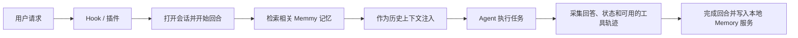

Agent Source 是 Memmy 读取外部 Agent 本地历史的适配器。来源扫描负责导入已经存在的对话；新对话中的自动召回和采集由 Hook 或插件接入负责。

<Callout type="warn" icon={false}>
  

    !
    历史扫描和实时接入是两件事
  

  “同步新增”读取 Agent 已写入本地的数据；Hook 或插件负责新对话中的自动召回、自动采集和任务接续。只扫描不会修改 Agent 配置，安装 Hook 或插件才会写入下文列出的配置和文件。
</Callout>

## 内置来源

| Agent | 默认历史来源 | 实时接入 |
| --- | --- | --- |
| Cursor | `~/Library/Application Support/Cursor/User/workspaceStorage/**/state.vscdb` 和 `globalStorage/state.vscdb` | Hook |
| Claude Code | `~/.claude/projects/**/*.jsonl` | Hook |
| Codex | `~/.codex/sessions/<YYYY>/<MM>/<DD>/rollout-*.jsonl` | Hook |
| OpenCode | `~/.local/share/opencode/opencode.db` | 原生插件 |
| OpenClaw | `~/.openclaw` 下的 conversation / memory SQLite | Memory 插件 |
| Hermes | `~/.hermes/sessions/**/*.jsonl` 和 `~/.hermes/state.db` | Memory Provider 插件 |

## 增量同步

- **同步新增**扫描全部已发现来源；每个来源也可以单独同步。
- 扫描可以暂停、继续或停止；进度通过 SSE 实时推送。
- **深度扫描**使用 `full` 模式回扫旧历史，需要二次确认。
- 可以手动添加列表之外的 Agent（名称 + 本地数据路径）；手动来源只负责扫描，不会自动获得 Hook 或插件。

### 为什么扫描消息数不等于新增记忆数

扫描和“添加中”的进度按**消息条数**计算，而记忆页按**记忆条数**计算，两者不是一一对应的。Memmy 先按来源和会话整理消息，再以完整对话回合为单位写入 L1 记忆：

- 一条用户消息会开启一个回合，后续的工具消息、系统消息和 Assistant 消息会合并到同一回合；回合必须以非空用户消息开始，并以非空 Assistant 消息结束。
- 一个完整回合只生成一条 L1 记忆。例如，“1 条用户消息 + 2 条工具消息 + 1 条 Assistant 消息”会显示处理了 4 条消息，但只添加 1 条记忆。
- 边界处重读的消息或已导入消息会通过会话检查点、来源消息 ID 和稳定回合 ID 去重；重复同步会更新或返回同一条记忆，而不会新增副本。
- 只有用户消息、缺少最终 Assistant 回复或内容为空的不完整回合会被跳过，等待后续同步补全。
- 超过大小上限的回合会被跳过；Memory 服务写入失败的回合会计为失败。这两种情况都不会新增记忆。

因此，“本次扫描/处理消息数”“已采集的唯一消息数”和“新增记忆数”可能分别不同。内置来源还会在计数前忽略非消息记录、提取可用文本，并对常见密钥和大段 Base64 数据做脱敏。

### 日期时间水位如何工作

每个来源单独维护日期时间水位，而不是只使用界面上显示的“上次扫描时间”：

1. 首次扫描开始时，Memmy 保存扫描开始时间作为基线，同时记录本次实际看到的最新消息时间；两者中较晚的时间成为下一次增量扫描的有效游标。
2. 后续点击 **同步新增** 时，内置来源会选择至少有一条消息时间**大于或等于**游标的会话。Memmy 会重读这些会话的完整消息，避免水位正好落在回合中间而丢失开头的用户请求。
3. `>=` 的包容边界会有意重读水位时刻的消息。导入前，会话检查点会比较最后消息的时间、消息 ID 和内容哈希；进入导入流程后，稳定的来源消息 ID 与回合 ID 再保证幂等。
4. 只有扫描和导入没有错误，且没有不完整或失败的会话时，水位才会推进到本次看到的最新时间。若扫描失败或回合尚未完成，水位保持不变，以便下次重试。界面上的“上次扫描时间”仍可能更新，它不等同于增量游标。

手动添加并由 Memmy 识别格式的 Agent 会保存首次导入的同步边界。后续同步只选择起始用户消息时间严格晚于该边界的完整回合，并继续依靠稳定消息 ID 和回合 ID 消除重复。

### 图片、文件与超大回合

图片或文件附件本身不会触发跳过。内置来源会从历史记录中提取可用文本，并在导入前将常见的内联 Base64 图片或文件内容替换为脱敏标记。

如果附件内容、文件正文、工具输出或其他长文本仍进入回合，Memmy 会按“用户请求 + 工具轨迹 + Assistant 回复 + 请求元数据”组成的完整记忆写入请求（`memory.add` JSON）计算 UTF-8 大小。请求超过 **2 MiB** 时，整个回合会被跳过，不会截断或拆成多条记忆；同一次同步中的其他回合会继续处理。该情况记为“已跳过”而不是同步失败，所以同步仍可能正常完成。大小限制针对完整回合请求，而不只是用户请求的字符数。

## 扫描偏好

| 开关 | 效果 |
| --- | --- |
| 自动扫描已知 Agent | Memmy 启动后检查内置来源的新对话 |
| 自动增量同步 | Agent 本地会话文件变化后继续同步新增内容 |
| 新发现 Agent 自动安装 Hook/插件 | 为新发现的内置 Agent 安装对应实时接入；精简 Skill 会随接入一并安装 |

关闭自动安装后，Agent 仍会出现在列表中，你可以手动点击 **安装 Hook** 或 **安装插件**。

## 数据处理与本地管理

- 每个成功写入的完整回合先成为一条 L1 原始记忆，再在后台生成摘要并建立索引。
- 可以查看本地数据路径（默认 `~/.memmy/memory-service`）、打开目录、导出 `memory.sqlite`，或在二次确认后清空本地记忆数据。
- 移除 Hook 或插件不会删除已经导入的历史；清空本地数据是单独的显式操作。

## Hook 与插件接入

Memmy 通过 Agent 原生支持的 **Hook** 或**插件**接入实时对话。安装接入能力时，Memmy 还会为该 Agent 自动安装一份精简的 `memmy-memory` Skill，用于在自动注入的上下文不足时主动搜索和读取记忆。

### 接入方式总览

| Agent | 接入类型 | 使用的事件或接口 | 主要效果 |
| --- | --- | --- | --- |
| Cursor | Hook | `beforeSubmitPrompt`、`afterAgentResponse`、`stop` | 建立回合、记录回复、在回合结束时自动采集，并支持 `/memmy-resume` |
| Claude Code | Hook | `UserPromptSubmit`、`Stop` | 请求前召回并注入相关记忆，结束时自动采集，支持 `/memmy-resume` |
| Codex | Hook | `UserPromptSubmit`、`Stop` | 请求前召回并注入相关记忆，结束时自动采集，支持 `/memmy-resume` |
| OpenCode | 原生插件 | 消息、工具、文本完成和会话事件 | 自动召回、采集回复与工具轨迹，并提供原生记忆工具和 `/memmy-resume` |
| OpenClaw | Memory 插件 | `before_prompt_build`、`agent_end` | 构建提示词前注入记忆，Agent 结束时采集完整回合，并提供原生记忆工具 |
| Hermes | Memory Provider 插件 | `prefetch`、`sync_turn` 等 Provider 生命周期 | 自动召回和采集，镜像 Hermes 的显式记忆写入，并提供原生记忆工具 |

### 一次对话中会发生什么

安装后的共同效果：

- **自动召回**：Claude Code、Codex、OpenCode、OpenClaw 和 Hermes 会在正常请求执行前检索相关记忆并注入上下文。
- **自动采集**：Hook 或插件会在回合结束时提交用户请求、Agent 回答和成功/失败状态，不需要 Agent 手动执行 `memmy-memory add`。
- **任务接续**：输入 `/memmy-resume <query>` 会搜索最多 5 个候选 L1 episode；继续输入 `1`–`5` 可读取完整 episode 并注入接续上下文。
- **按需查询**：随接入安装的 Skill 保留 `memmy-memory search` 和 `memmy-memory get`，只在自动上下文不足时使用。
- **来源标记**：采集结果会记录 `cursor`、`claude_code`、`codex`、`opencode`、`openclaw` 或 `hermes`，便于过滤和追踪来源。

<Callout type="warn" icon={false}>
  

    !
    Cursor 当前的 Hook 重点负责自动采集和 <code>/memmy-resume</code>
  

  普通请求需要额外记忆时，由随 Hook 安装的 Skill 执行按需搜索；其他五个接入会在普通请求前自动注入召回结果。
</Callout>

### Cursor：三个 Hook

Memmy 会在 `~/.cursor/hooks.json` 中追加自己的 Hook 条目，不会覆盖其他 Hook。

| Hook | 触发时机 | Memmy 的处理 |
| --- | --- | --- |
| `beforeSubmitPrompt` | 用户请求提交前 | 打开或复用 Memmy 会话、开始回合并保存请求；同时拦截 `/memmy-resume` 搜索和候选选择 |
| `afterAgentResponse` | Agent 生成回复后 | 将最终回复暂存在本回合状态中，供结束 Hook 采集 |
| `stop` | Agent 回合停止时 | 汇总请求和回复，调用 turn-complete 接口自动保存回合；失败时放行，不阻塞 Cursor |

默认写入或更新：

- `~/.cursor/hooks.json`
- `~/.cursor/hooks/memmy-resume-hook.mjs`
- `~/.cursor/hooks/memmy-memory-config.json`
- `~/.cursor/skills/memmy-memory/SKILL.md`

### Claude Code：`UserPromptSubmit` 与 `Stop`

| Hook | 触发时机 | Memmy 的处理 |
| --- | --- | --- |
| `UserPromptSubmit` | 用户请求进入模型前 | 开始 Memmy 回合，把召回结果放入 `additionalContext`；处理 `/memmy-resume` |
| `Stop` | Claude Code 完成或终止回合时 | 从 Hook payload 或 transcript 读取请求与回答，按 `succeeded`、`failed` 或 `cancelled` 完成回合 |

默认写入或更新：

- `~/.claude/settings.json`
- `~/.claude/hooks/memmy-resume-hook.mjs`
- `~/.claude/hooks/memmy-memory-config.json`
- `~/.claude/commands/memmy-resume.md`
- `~/.claude/CLAUDE.md`
- `~/.claude/skills/memmy-memory/SKILL.md`

### Codex：`UserPromptSubmit` 与 `Stop`

| Hook | 触发时机 | Memmy 的处理 |
| --- | --- | --- |
| `UserPromptSubmit` | 用户请求提交前 | 开始回合并通过 Hook 的 `additionalContext` 注入相关记忆；处理 `/memmy-resume` |
| `Stop` | Codex 回合停止时 | 从 transcript 或最后一条 Assistant 消息提取回答并完成回合，保留失败和取消状态 |

默认写入或更新：

- `~/.codex/hooks.json`
- `~/.codex/hooks/memmy-resume-hook.mjs`
- `~/.codex/hooks/memmy-memory-config.json`
- `~/.codex/AGENTS.md`
- `~/.codex/skills/memmy-memory/SKILL.md`

### OpenCode：原生插件

| 回调 | 效果 |
| --- | --- |
| `chat.message` | 开始回合、自动注入召回结果，并处理 `/memmy-resume` |
| `tool.execute.before` / `tool.execute.after` | 记录非 Memmy 工具的调用参数与结果，作为回合轨迹的一部分 |
| `experimental.text.complete` / `message.part.updated` | 收集 Assistant 的完整文本输出 |
| `session.error` | 把当前回合标记为失败并记录错误 |
| `session.idle` | 异步完成并采集当前回合 |
| `dispose` | 插件卸载或进程退出前刷新尚未提交的回合 |

插件还注册 `memmy_memory_search`、`memmy_memory_get`、`memmy_memory_add` 三个原生工具。

默认在 `~/.config/opencode` 中写入或更新：

- `plugins/memmy-memory.js`
- `plugins/memmy-memory-config.json`
- `commands/memmy-resume.md`
- `AGENTS.md`
- `skills/memmy-memory/SKILL.md`

如果设置了 `OPENCODE_CONFIG_DIR` 或 `XDG_CONFIG_HOME`，文件会写入对应配置目录。

### OpenClaw：Memory 插件

| 接口 | 效果 |
| --- | --- |
| `registerMemoryCapability` | 告诉 OpenClaw 当前启用了 Memmy，并声明注入内容属于历史上下文 |
| `before_prompt_build` | 在构建提示词前开始回合，通过 `prependContext` 注入召回结果或选中的 episode |
| `agent_end` | 提取本轮请求、回答和工具轨迹，同步完成回合，避免进程结束时丢失采集结果 |
| `registerCommand` | 注册 `/memmy-resume` |
| `registerTool` | 注册 `memmy_memory_search`、`memmy_memory_get`、`memmy_memory_add` |

安装时会把 `plugins.slots.memory` 指向 `memmy-memory`，并启用 `allowPromptInjection` 与 `allowConversationAccess`。

默认写入或更新：

- `~/.openclaw/extensions/memmy-memory/`
- `~/.openclaw/openclaw.json`
- `~/.openclaw/skills/memmy-memory/SKILL.md`
- OpenClaw workspace 下的 `AGENTS.md`（默认 `~/.openclaw/workspace/AGENTS.md`）

OpenClaw 的 memory slot 只能有一个提供者。如果已安装其他记忆插件，Memmy 会在安装前提示：替换现有插件，或保留现有插件并只安装 Skill。

### Hermes：Memory Provider 插件

| Provider 接口 / Hook | 效果 |
| --- | --- |
| `system_prompt_block` | 声明 Memmy 已启用，并约束注入记忆只作为历史上下文 |
| `prefetch` | 用户请求前开始回合并返回相关记忆上下文 |
| `sync_turn` | 在后台线程完成回合，自动采集用户请求和 Assistant 回复 |
| `on_memory_write` | 将 Hermes 发出的显式记忆写入同步到 Memmy |
| `on_session_switch` | 让 Memmy 会话跟随 Hermes 会话切换 |
| `get_tool_schemas` / `handle_tool_call` | 提供 `memmy_memory_search`、`memmy_memory_get`、`memmy_memory_add` |
| `pre_llm_call` / `pre_gateway_dispatch` | 识别 `/memmy-resume` 的候选编号并注入或重写为完整 episode 上下文 |

安装时会把 `memory.provider` 设为 `memmy-memory`，启用 `memory` toolset 和独立的 `memmy-resume` command plugin。

默认写入或更新：

- `~/.hermes/plugins/memmy-memory/`
- `~/.hermes/plugins/memmy-resume/`
- `~/.hermes/config.yaml`
- `~/.hermes/SOUL.md`
- `~/.hermes/skills/memmy-memory/SKILL.md`

Hermes 同样只允许一个活动的 Memory Provider；检测到其他 Provider 时，Memmy 会先请求确认。

### 安装、验证与移除

1. 打开 **记忆管理 → 跨Agent接入**。
2. Cursor、Claude Code、Codex 点击 **安装 Hook**；OpenCode、OpenClaw、Hermes 点击 **安装插件**。
3. 如果 Agent 正在运行，重启 Agent 或新建会话，让它重新加载配置。
4. 完成一轮普通对话，再到 Memmy 的记忆或日志页面确认对应来源出现新记录。
5. 输入 `/memmy-resume <关键词>`，确认能看到候选并用 `1`–`5` 选择一个 episode。

点击 **移除 Hook** 或 **移除插件** 时，Memmy 会停用并清理自己管理的实时接入和附带 Skill；其他 Hook 配置会保留，已经进入 Memmy 的历史记忆不会被删除。

### 本地访问与失败行为

- Hook 和插件从 `~/.memmy/config.yaml` 读取 Memory 服务地址与 token，并把运行所需配置保存在对应 Agent 的本地配置目录。请不要公开这些配置文件。
- Memmy 注入的内容使用 `<memmy_memory_context>` 标记为历史记忆，并用 `<current_user_request>` 明确当前请求，降低旧记忆被误当成新指令的风险。
- 召回或采集失败时采用 **fail-open**：记录错误并继续 Agent 的当前任务，不会因为 Memory 服务暂时不可用而中断正常对话。
- Hook 命令的宿主超时为 60 秒，单次 Memory 请求超时为 45 秒。
