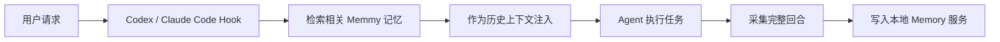

Agent Source 负责读取 Codex 与 Claude Code 的本地历史。历史扫描导入已有对话；Hook 负责新对话中的自动召回与采集。

## 支持范围

| Agent | 默认历史来源 | 实时接入 |
| --- | --- | --- |
| Claude Code | `~/.claude/projects/**/*.jsonl` | Hook + `memmy-memory` Skill |
| Codex | `~/.codex/sessions/<YYYY>/<MM>/<DD>/rollout-*.jsonl` | Hook + `memmy-memory` Skill |

可以分别使用 `CLAUDE_CONFIG_DIR` 和 `CODEX_HOME` 覆盖默认目录。

## 增量同步

- **同步新增**只处理水位之后新增或仍未完成的会话。
- **深度扫描**会回扫旧历史，执行前需要确认。
- 每个来源独立维护水位；失败或不完整回合不会推进水位，后续可以安全重试。
- 来源消息 ID、稳定回合 ID 与内容哈希共同保证重复扫描不会重复创建记忆。

扫描按消息计数，记忆按完整对话回合计数，因此两者不会一一对应。只有包含非空用户请求与最终 Assistant 回复的完整回合才会写入记忆；工具轨迹会并入同一回合。

## 实时接入

共同效果：

- 请求前自动召回相关记忆，并用明确的历史上下文边界注入。
- 回合结束后自动采集用户请求、Assistant 回复和执行状态。
- 安装 `memmy-memory` Skill，自动上下文不足时可主动搜索和读取完整记忆。
- 召回或采集失败时采用 fail-open，不阻断 Codex 或 Claude Code 当前任务。

### Claude Code

默认写入或更新：

- `~/.claude/settings.json`
- `~/.claude/hooks/memmy-resume-hook.mjs`
- `~/.claude/hooks/memmy-memory-config.json`
- `~/.claude/commands/memmy-resume.md`
- `~/.claude/CLAUDE.md`
- `~/.claude/skills/memmy-memory/SKILL.md`

### Codex

默认写入或更新：

- `~/.codex/hooks.json`
- `~/.codex/hooks/memmy-resume-hook.mjs`
- `~/.codex/hooks/memmy-memory-config.json`
- `~/.codex/AGENTS.md`
- `~/.codex/skills/memmy-memory/SKILL.md`

## 安装与验证

1. 打开 **记忆管理 → 跨 Agent 接入**。
2. 为 Claude Code、Codex 点击 **安装 Hook**。
3. 重启对应 Agent 或新建会话，让它重新加载配置。
4. 完成一轮普通对话，在 Memmy 的记忆与日志页面确认出现对应来源的新记录。
5. 在另一个 Agent 中询问刚才的项目事实，确认能召回同一份记忆。

移除 Hook 时只清理由 Memmy 管理的接入文件和 Skill，不会删除已经导入的历史记忆。

## 本地与安全

- Hook 从本机 Memmy 配置读取 Memory 服务地址和 token；不要公开这些配置文件。
- 常见密钥和大段 Base64 数据会在导入前脱敏。
- 单个完整回合请求超过 2 MiB 时会跳过该回合，其他回合继续处理。
- 本分支不扫描 ChatWise、OpenCode、OpenClaw、Hermes、WorkBuddy 或任何消息渠道。
